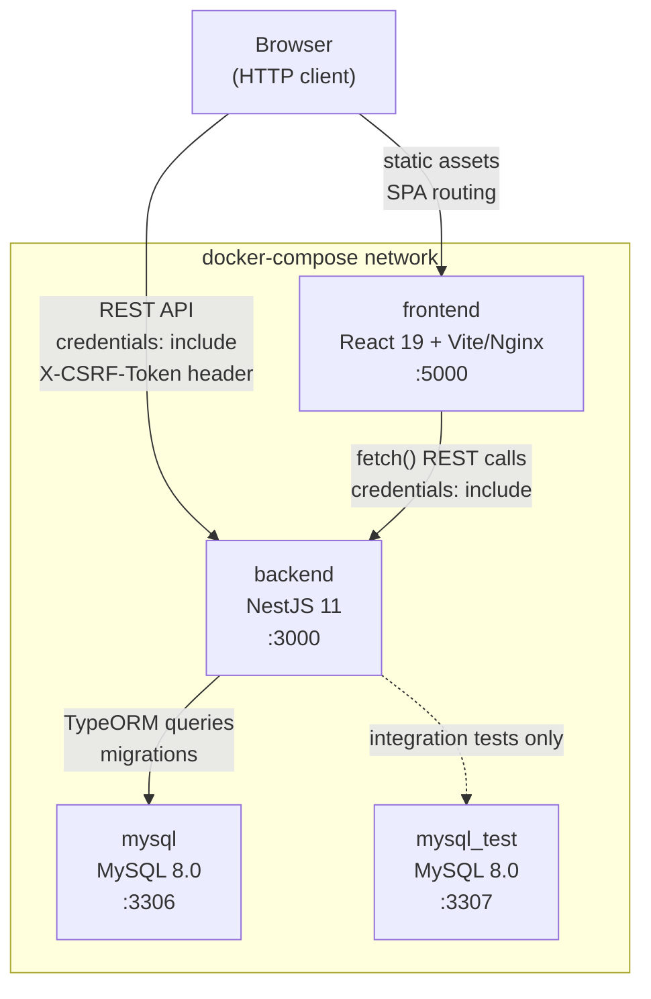
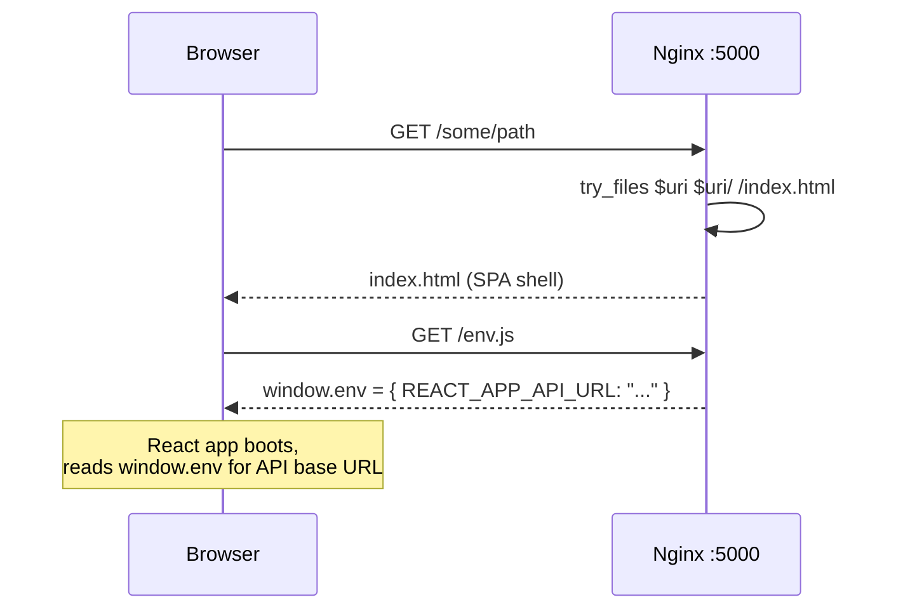
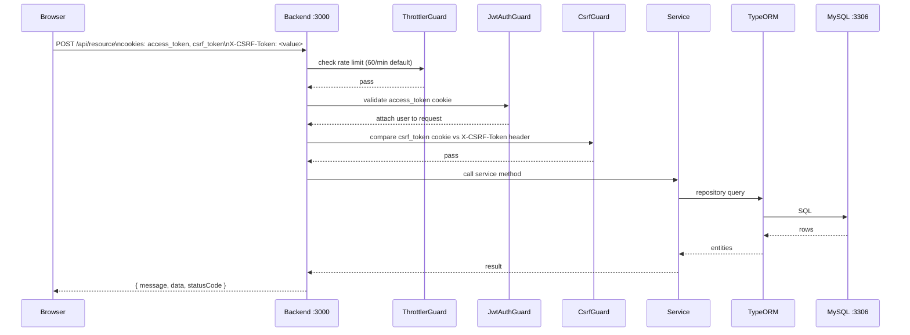
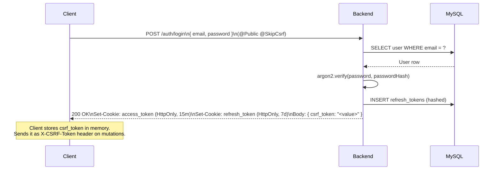
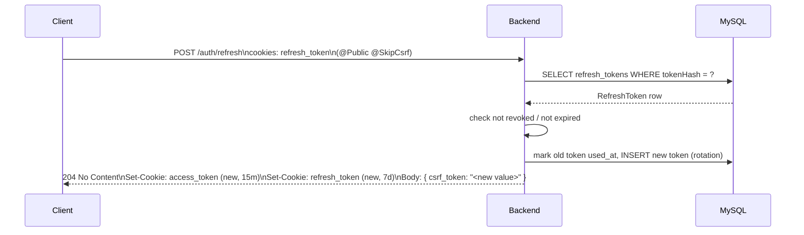
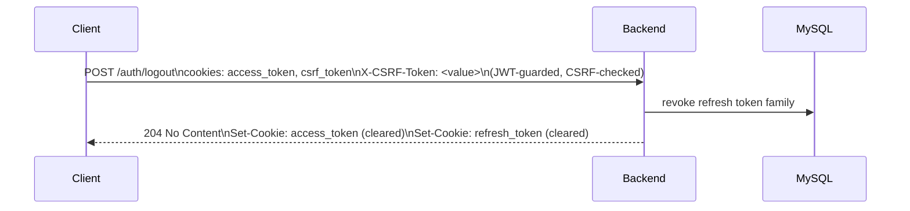

# System Architecture

Describes the runtime topology, service interactions, and cross-cutting concerns for the School Uniform monorepo. Intended audience: developers and ops engineers who need to understand, debug, or extend the system without reading source code.

For security control details see [security-guidelines.md](./security-guidelines.md).

---

## Table of Contents

1. [Container Overview](#1-container-overview)
2. [Component Table](#2-component-table)
3. [Request Flow](#3-request-flow)
4. [Auth Flow](#4-auth-flow)
5. [Global Middleware and Guard Stack](#5-global-middleware-and-guard-stack)
6. [i18n Resolution Chain](#6-i18n-resolution-chain)
7. [Logging Architecture](#7-logging-architecture)
8. [Rate Limiting](#8-rate-limiting)
9. [Data Model Snapshot](#9-data-model-snapshot)
10. [Environment Variables](#10-environment-variables)
11. [Deployment Topology](#11-deployment-topology)

---

## 1. Container Overview



**Notes:**
- The frontend container serves the React SPA via Nginx. All unknown paths fall back to `/index.html` (client-side routing).
- The backend exposes a REST API. Authentication uses HttpOnly cookies — no Bearer token in JS.
- `mysql_test` is only used during integration test runs; it is not connected to in any production path.

---

## 2. Component Table

| Layer | Technology | Container | Port | Purpose |
|---|---|---|---|---|
| Frontend | React 19 + Vite + Tailwind v4 + Nginx | `frontend` | 5000 | SPA served as static files; runtime config injected by `entrypoint.sh` |
| Backend | NestJS 11 + TypeORM 0.3 | `backend` | 3000 | REST API, auth, business logic |
| Primary DB | MySQL 8.0 | `mysql` | 3306 | Application data |
| Test DB | MySQL 8.0 | `mysql_test` | 3307 | Integration test isolation; not used in production paths |

---

## 3. Request Flow

### 3.1 Static Asset Request



### 3.2 API Request



---

## 4. Auth Flow

### 4.1 Login



### 4.2 Token Refresh



### 4.3 Logout



---

## 5. Global Middleware and Guard Stack

Registered in `app.module.ts` via `APP_GUARD` / `APP_INTERCEPTOR` / `APP_FILTER` providers. This is the canonical execution order for every HTTP request:

```
Helmet (HTTP security headers)
  → cookie-parser (parse signed cookies)
    → CORS check
      → ValidationPipe (DTO whitelist + transform)
        → ThrottlerGuard   (60 req / 60 s default)
          → JwtAuthGuard   (validates access_token cookie; 401 if invalid)
            → CsrfGuard    (POST/PUT/PATCH/DELETE: cookie == header; 403 if mismatch)
              → Route Handler
                → ResponseInterceptor (wraps response in { message, data, statusCode })
```

Error path (any exception):
```
AllExceptionsFilter → { error, message, statusCode } JSON envelope
```

| Component | Class | Scope |
|---|---|---|
| `ValidationPipe` | NestJS built-in | Global (main.ts) |
| `ThrottlerGuard` | `@nestjs/throttler` | Global (APP_GUARD) |
| `JwtAuthGuard` | `auth/guards/jwt-auth.guard` | Global (APP_GUARD) |
| `CsrfGuard` | `common/guards/csrf.guard` | Global (APP_GUARD) |
| `ResponseInterceptor` | `common/interceptors/response.interceptor` | Global (APP_INTERCEPTOR) |
| `AllExceptionsFilter` | `common/filters/all-exceptions.filter` | Global (APP_FILTER) |

**Swagger UI** is available at `/docs` when `SWAGGER_ENABLED=true` or `NODE_ENV !== production`.

---

## 6. i18n Resolution Chain

Backend uses `nestjs-i18n`. Default locale: `vi` (overridden by `DEFAULT_LOCALE` env var).

Resolution priority (first match wins):

```
1. Query parameter  ?lang=en
2. Custom header    x-lang: en
3. Standard header  accept-language: en-US,en;q=0.9
4. Fallback         vi  (DEFAULT_LOCALE)
```

Translation files live in `backend/src/i18n/<locale>/`. The build process copies them to `dist/i18n/` at compile time. In development mode (`NODE_ENV=development`) the i18n loader watches for file changes.

Error messages from `AllExceptionsFilter` are translated through i18n using the message string as a key (e.g., `auth.invalid_credentials` → `"Email hoặc mật khẩu không đúng"`).

---

## 7. Logging Architecture

```
Service / Controller
  → Logger (nestjs-pino)
    → pino (structured JSON)
      → stdout
        → docker logs / log aggregator
```

**Configuration** (from `app.module.ts`):

| Setting | Value |
|---|---|
| Default level | `info` (overridden by `LOG_LEVEL` env) |
| Development transport | `pino-pretty` (colorized, single-line) |
| Production transport | raw JSON to stdout |
| Redacted fields | `req.headers.authorization`, `req.headers.cookie`, `*.password`, `*.token` |

**Rules:**
- Never use `console.log` in application code; use the injected `Logger`.
- Log levels: `log` (info), `warn`, `error` (with stack), `debug`, `verbose`.
- All HTTP requests are logged automatically by `nestjs-pino` (pino-http middleware).

---

## 8. Rate Limiting

Provided by `@nestjs/throttler`. Global defaults registered in `ThrottlerModule`:

| Parameter | Value |
|---|---|
| Window | 60 000 ms (60 seconds) |
| Limit | 60 requests per window |
| Scope | Per IP, global |

Endpoints can override the default with `@Throttle()`:

```typescript
// Login is more restricted: 5 attempts per 60 s
@Throttle({ default: { ttl: 60_000, limit: 5 } })
@Post('login')
```

---

## 9. Data Model Snapshot

All application entities extend `BaseEntity`.

### BaseEntity (`common/entities/base.entity.ts`)

| Column | Type | Notes |
|---|---|---|
| `id` | `varchar(36)` UUID | Primary key, auto-generated |
| `createdAt` | `datetime` | Set on insert |
| `updatedAt` | `datetime` | Updated on every save |
| `deletedAt` | `datetime` nullable | Soft-delete support |

### User (`users/entities/user.entity.ts`) — table: `users`

| Column | DB name | Type | Notes |
|---|---|---|---|
| `id` | `id` | UUID | Inherited from BaseEntity |
| `email` | `email` | varchar | Unique |
| `passwordHash` | `password_hash` | varchar | argon2 hash |
| `firstName` | `first_name` | varchar | Default `''` |
| `lastName` | `last_name` | varchar | Default `''` |
| `role` | `role` | varchar | `'user'` or `'admin'`; default `'user'` |
| `createdAt` | `created_at` | datetime | Inherited |
| `updatedAt` | `updated_at` | datetime | Inherited |
| `deletedAt` | `deleted_at` | datetime | Inherited; soft-delete |

### RefreshToken (`auth/entities/refresh-token.entity.ts`) — table: `refresh_tokens`

| Column | DB name | Type | Notes |
|---|---|---|---|
| `id` | `id` | UUID | Inherited |
| `userId` | `user_id` | varchar | FK to users.id (no ORM relation — loose coupling) |
| `familyId` | `family_id` | varchar | Groups tokens in a rotation chain |
| `tokenHash` | `token_hash` | varchar | argon2 hash of the raw refresh token |
| `usedAt` | `used_at` | datetime nullable | Set when token is rotated |
| `revokedAt` | `revoked_at` | datetime nullable | Set on family revocation (theft detection) |
| `expiresAt` | `expires_at` | datetime | Hard expiry |

Index: `(userId, familyId)` for efficient family lookups.

---

## 10. Environment Variables

All vars are validated at startup by `src/config/env-validation.schema.ts` (Joi). Missing required vars abort the process.

| Variable | Required | Default | Purpose |
|---|---|---|---|
| `NODE_ENV` | No | `development` | Controls pino-pretty transport, swagger gate |
| `PORT` | No | `3000` | Backend listen port |
| `DB_HOST` | No | `localhost` | MySQL host |
| `DB_PORT` | No | `3306` | MySQL port |
| `DB_USER` | **Yes** | — | MySQL username |
| `DB_PASSWORD` | **Yes** | — | MySQL password |
| `DB_NAME` | **Yes** | — | MySQL database name |
| `JWT_ACCESS_SECRET` | **Yes** | — | Signs access tokens |
| `JWT_REFRESH_SECRET` | **Yes** | — | Signs refresh tokens |
| `JWT_ACCESS_TTL` | No | `15m` | Access token lifetime |
| `JWT_REFRESH_TTL` | No | `7d` | Refresh token lifetime |
| `COOKIE_SECRET` | No | — | Signs cookies (recommended in production) |
| `COOKIE_DOMAIN` | No | `localhost` | Cookie domain scope |
| `CORS_ORIGINS` | No | `http://localhost:5000` | Comma-separated allowed origins |
| `SWAGGER_ENABLED` | No | `true` | Expose `/docs` UI (`true`/`false`) |
| `LOG_LEVEL` | No | `info` | Pino log level |
| `DEFAULT_LOCALE` | No | `vi` | i18n fallback locale |

Frontend runtime variable (injected by `entrypoint.sh` into `window.env`):

| Variable | Purpose |
|---|---|
| `REACT_APP_API_URL` | Backend API base URL; read as `window.env.REACT_APP_API_URL` |

---

## 11. Deployment Topology

### Current (Development)

All services are managed by `docker-compose`. No external load balancer or TLS termination.

```
Host machine
  └─ docker-compose
       ├─ frontend  :5000  (Nginx serving React build)
       ├─ backend   :3000  (NestJS, NODE_ENV=development)
       ├─ mysql     :3306  (primary DB)
       └─ mysql_test :3307 (test DB, used only in CI/test runs)
```

The frontend dev container uses `dev.Dockerfile` (live reload). The backend uses `Dockerfile` with `npm run start:dev` (ts-node watch).

### Production (Future Work)

Production deployment behind a reverse proxy is **not yet implemented**. The intended topology:

```
Internet
  └─ Reverse proxy (TLS termination, e.g., Nginx or Traefik)
       ├─ /          → frontend :5000  (or pre-built CDN)
       └─ /api/*     → backend  :3000
            └─ mysql :3306  (private network, not exposed)
```

When deploying to production:
- Build frontend with `Dockerfile.production`; Nginx serves static build at port 5000.
- Set `NODE_ENV=production` on the backend container.
- Set `SWAGGER_ENABLED=false` (or omit to let NODE_ENV gate it).
- Set `COOKIE_SECRET`, `COOKIE_DOMAIN`, `CORS_ORIGINS` to production values.
- Ensure `mysql` is **not** port-exposed to the public network.
- Run `make be-migrate` (not `synchronize`) before starting the backend container.

For security control details (Helmet headers, cookie flags, CSRF implementation, argon2 parameters) see [security-guidelines.md](./security-guidelines.md).
